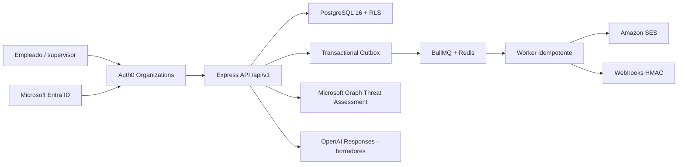

# CyberShield Enterprise Pilot

## Resultado implementado

La aplicación conserva React, Express, PostgreSQL y Redis, pero el runtime ya no depende del `seed-store`: la API usa repositorios PostgreSQL, migraciones versionadas y contexto de empresa. Los seeds permanecen exclusivamente para desarrollo.

## Capacidades disponibles

- Identidad OIDC/JWKS con Auth0 y puente React; los tokens `mock:*` solo existen con `DEMO_MODE=true` fuera de producción.
- Empresas como raíz multitenant, filtros explícitos y siete políticas RLS.
- Campañas con audiencia, exclusiones, máximo de 2,000 personas, aprobación y estados controlados.
- Outbox, BullMQ, reintentos exponenciales, rate limit y DLQ.
- Tokens de simulación aleatorios; solo se almacena SHA-256 y la API acepta eventos idempotentes.
- Eventos `DELIVERED`, `BOUNCED`, `CLICKED`, `ATTEMPTED_ACTION`, `REPORTED` e `IGNORED`; no se mide apertura.
- HRS-2.0 con snapshots, cuatro contribuciones, dificultad, vida media de 90 días, contexto de exposición separado y confianza.
- Analítica que suprime grupos de menos de cinco personas.
- 8 módulos y 13 escenarios versionados en español, con MITRE, fuentes y fecha de revisión.
- Autoría con Responses API y JSON Schema; la entrada excluye PII y todo resultado queda en `REVIEW`.
- Threat Assessment de Microsoft Graph con el permiso mínimo `ThreatAssessment.ReadWrite.All`.
- Webhooks con secreto mostrado una sola vez, firma HMAC, allowlist de hosts, reintentos y DLQ.
- CSV, PDF y feed SIEM agregado; el feed oculta cohortes menores de cinco.

## Criterios del piloto

La comparación de 90 días debe segmentarse por técnica y dificultad equivalente. Las dos métricas primarias son tasa de reporte y tasa de acción insegura. El score no es una medida disciplinaria ni un ranking: con confianza baja solo se muestra como señal exploratoria.

Referencias de contenido: NIST CSF 2.0, NIST SP 1308, MITRE ATT&CK T1566, CISA Secure Our World y la guía de MFA resistente al phishing. Toda fuente está versionada en los registros de contenido y debe revisarse cada trimestre.
