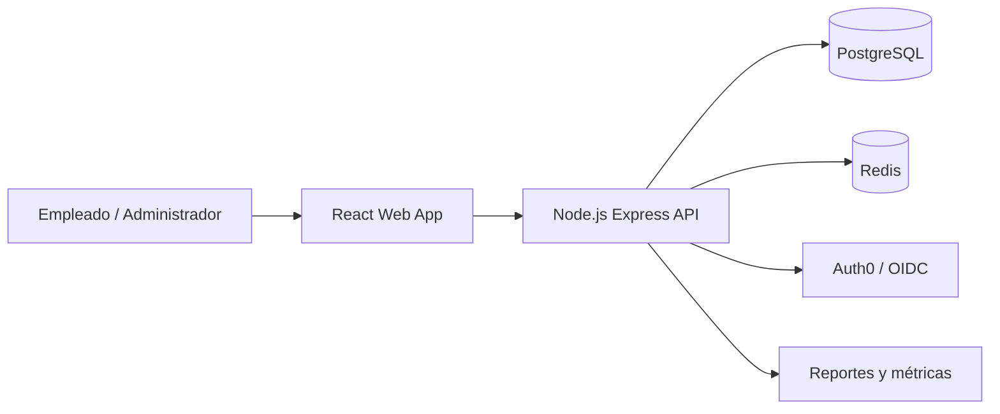

# Arquitectura inicial

## Enfoque

CyberShield se estructura como un monorepo con frontend, backend, paquete compartido, base de datos, infraestructura y documentación.

## Componentes

## Responsabilidades

### Frontend

- Pantalla inicial tipo dashboard.
- Visualización de Cyber Risk Score.
- Ruta recomendada de entrenamiento.
- Futuras pantallas de login, módulos, simulaciones y reportes.

### Backend

- API REST.
- Cálculo del Cyber Risk Score.
- Catálogo de módulos.
- Futuras reglas de roles, autenticación, simulaciones y reportes.

### Base de datos

- Empresas.
- Usuarios.
- Módulos.
- Progreso.
- Simulaciones.
- Resultados.
- Risk scores.

## Patrones de diseño sugeridos

- **Strategy:** cálculo de riesgo, evaluación de módulos y reglas de autorización.
- **Factory Method:** creación de módulos de entrenamiento según categoría.
- **Observer/Event Bus:** actualización de progreso, reportes y notificaciones después de eventos.
